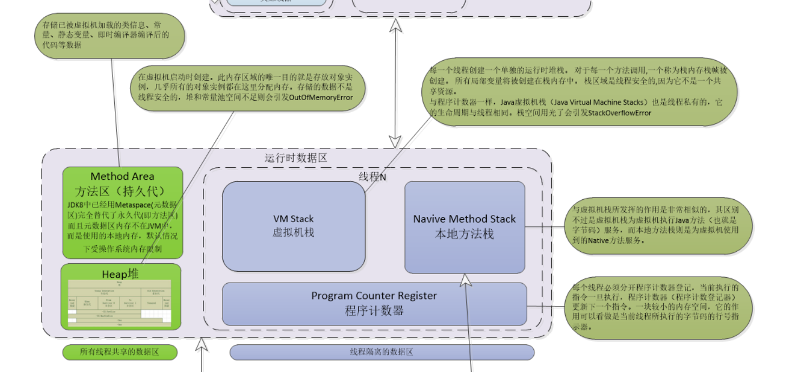
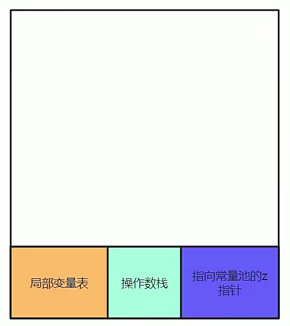
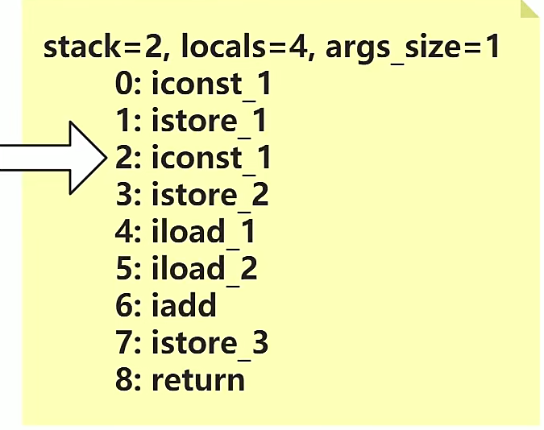
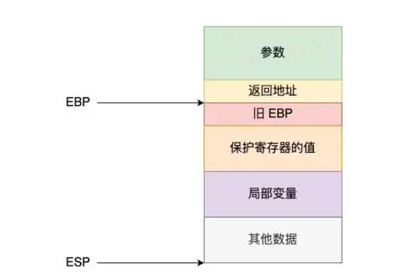
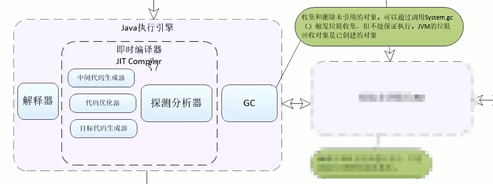
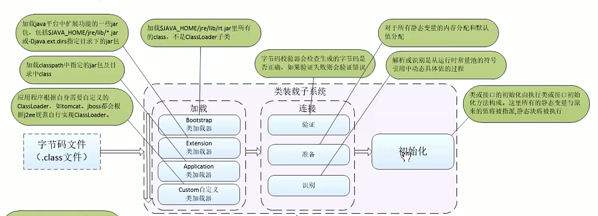

# JVM内存模型

## Java虚拟机运行时数据区

Java 虚拟机在执行Java程序的过程中会把它所管理的内存划分为若干个不同的数据区域，这些区域有着各自的用途以及创建和销毁的时间。

结构如下



### VM Stack （虚拟机栈）

Java 虚拟机栈是**线程私有**的， 生命周期与线程相同。 虚拟机栈描述的是Java方法执行的线程存储模型： 每个方法被执行的时候， Java虚拟机都会同步创建一个 `栈帧 (Stack Frame)` 用于存储`局部变量表`、`操作数栈`、`动态链接`、`方法出口`等信息。 每一个方法从调用至执行完毕的过程，就对应一个 `栈帧` 在虚拟机栈中入栈导出栈的过程。

结构如图



#### 理解示例：

```java
public class demo {
    public static void main(String[] args) {
        int a = 1;
        int b = 1;
        int c = a + b;
    }
}
```

编译该程序后字节码如下图



其中

- iconst_x 指令是指将一个值压入`操作数栈`中
- istore_x 指令是指从栈顶值保存为 `局部变量x` 到写入 `局部变量表` 中
- iload_x 指令是指从 `局部变量表` 中装载 `局部变量x` 值入栈
- iadd 将栈顶两int类型数相加，结果入栈
- return void函数返回

更多指令参考 [Java 字节码指令集.md](./Java 字节码指令集.md)


### Program Counter Register (程序计数器)

程序计数器是一块较小的内存空间，可以看做是当前线程所执行字节码的行号指示器。

在Java虚拟机的概念模型中，字节码解释器工作时就是通过改变该计数器的值来选取下一条需要执行的字节码指令，他是程序控制流的指示器，分支、循环、跳转、异常处理、线程恢复等基础功能都依赖计数器来完成。

java虚拟的的多线程是通过线程轮流切换、分配处理器执行时间的方式实现的，所以，在任何一个确定的时刻，一个处理器（对于多核处理器来说为一个内核）都只会执行一条线程中的指令。因此，为了线程切换后能恢复正确的执行位置，每条线程都需要有一个独立的 `程序计数器`, 各线程间线程互不影响，独立存储，我们称这类内存区域为 “**线程私有**” 的内存。

如果线程正在执行的是一个Java方法，这个计数器记录的是正在执行虚拟机字节码指令的地址； 如果执行的是本地 (Native) 方法，这个计数器值则应为空 （Undefined）.

此内存区域是唯一一个在 《Java虚拟机规范》中没有规定任何 OutOfMemoryError情况的区域。


### Native Method Stack (本地方法栈)

本地方法栈与虚拟机栈所发挥的作用是非常相似的，其区别知识虚拟机栈为虚拟机执行Java方法(也就是字节码)服务，而本地方法栈则是为虚拟机使用到的本地（方法）服务。

**扩展 - C 语言函数调用栈**

**栈帧**

栈帧主要包括以下几个内容：

- 函数的返回地址和参数
- 本地变量
- 调用前后上下文

EBP寄存器指向了一个旧的EBP起始地址，ESP执行栈顶，一个栈帧的具体结构如下图。



参数内容之后便是当前函数的栈帧，EBP固定执行旧的EBP起始地址，而旧的EBP存储着上一个函数的执行地址，这样等到末尾出栈之后就能按层级返回上一级函数了，而ESP总是执行栈顶，会随着函数的调用或这些不断变化。

那么EBP可以用来做什么呢？

**EBP可以根据地址的加减，来获取响应的栈帧内容**，比如获取返回地址 ebp-4就是 返回地址，参数也可以用ebp-8、ebp-12来获取，为什么是-4呢，我们在开头约定了是在32位机器下，4个字节就是32位了。所以EBP寄存器可以用来追踪我们的函数调用链，从而定位相关出错问题。

**调用过程**

上面介绍了调用栈，这里具体来看看一个函数调用链的怎么形成的。

- 根据栈帧的结构图，首先将参数入栈。
- 执行完这个函数之后，返回回来得接着执行，所以要将当前指令的下一条指令压入栈中，然后跳到函数体执行。
- 将EBP压入栈中，此时的ebp还是保存着调用函数的ebp，也就是Old EBP。
- 此时EBP其实指向栈顶的，所以将EBP的值赋给ESP，ESP就指向栈顶了。
- 在栈区分配空间，保存old函数用到的寄存器数据。因为被调用函数执行完之后，要回到之前的函数执行，那么之前函数用到的数据得保护起来，以便于后续正常执行。
- 被调用函数执行完，恢复相关寄存器数据，同时恢复ESP以前的数据，回收分配的空间，以及恢复EBP的数据。
- 最后从栈帧中取到返回地址，并回到调用函数处下一条指令执行。

上面的几个步骤就是一个函数调用另一个函数的过程了，如果是多个函数调用，形成一条链，也是类似的。


### 方法区


### Java堆


## Java 执行引擎

用来执行我们的字节码，对字节码进行优化，再执行GC



### 解释器

解释器有两种，一个是c++ 解释字节码，一个是汇编解释字节码

### 即时编译器


### GC（垃圾回收器）

[link for GC算法](./GC算法.md)


## Java类加载器

 